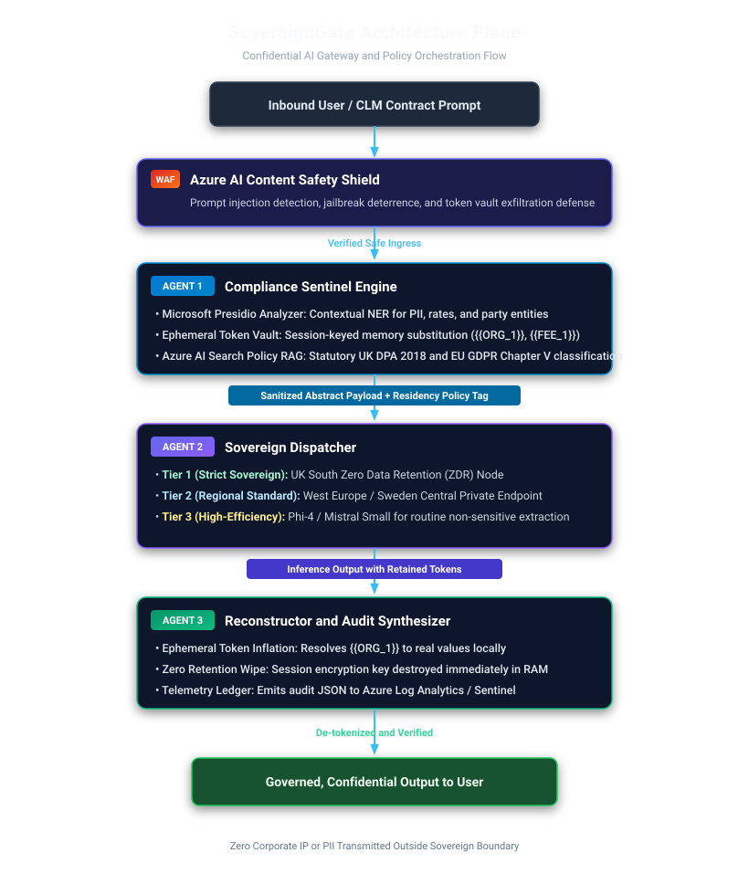

# SovereignGate: Modernization & Enterprise Architecture Roadmap

This document outlines the evolutionary steps from the hackathon working prototype into an enterprise-ready Confidential AI Gateway and Governance Plane built natively on Azure AI Foundry.

---

## 1. Upgraded Core Agent Architecture

To transition from heuristic regex redaction to enterprise-grade compliance governance, SovereignGate's layers evolve into an integrated defense pipeline:

* **Enterprise PII & Entity Extraction:** Replace basic regex with **Microsoft Presidio Analyzer**, combining machine-learning Named Entity Recognition (NER) models with checksum verification (IBANs, credit cards, national IDs) and domain-specific CLM recognizers.
* **Adversarial & Prompt Injection Defense:** Bind **Azure AI Content Safety Prompt Shields** to scan inbound prompts for jailbreak attempts that try to extract the token vault, while monitoring outbound responses to prevent system prompt leakage.
* **Agentic Statutory Grounding:** Equip the Compliance Sentinel with **Azure AI Search** vector retrieval over UK DPA 2018, EU GDPR Chapter V, and Standard Contractual Clauses (SCCs) to dynamically assign data residency tiers.
* **Intelligent Sovereign Dispatching:** Replace static endpoint calls with dynamic multi-tier routing across Azure AI Foundry deployments based on legal sensitivity, latency budgets, and inference cost.
* **Ephemeral Envelope Encryption:** Encrypt the in-memory token vault with AES-256 session keys generated per request and destroyed immediately after reconstruction.
* **Continuous Safety Benchmarking:** Integrate the **Azure AI Evaluation SDK** to quantify data leakage rates, semantic coherence, and model faithfulness across adversarial test suites.

---

## 2. Technical Architecture & Component Enhancements

### Pipeline Stages & Operational Responsibilities

| Stage | Component | Core Responsibility |
| :--- | :--- | :--- |
| **Ingress Defense** | **Azure AI Content Safety** | Intercepts adversarial prompts, jailbreaks, and extraction attacks before token processing. |
| **Stage 1** | **Compliance Sentinel** | Presidio-based PII identification, local token-vault substitution, and Azure AI Search policy classification. |
| **Stage 2** | **Sovereign Dispatcher** | Policy-driven model routing between Tier 1 (UK South ZDR), Tier 2 (West Europe), and Tier 3 (Local/Phi-4). |
| **Stage 3** | **Reconstructor & Audit** | In-memory token re-inflation, zero-retention memory purge, and real-time telemetry emission to Sentinel. |

### Detailed Component Deep Dive

* **Context-Aware Entity Shielding (Microsoft Presidio):** Integrates spaCy transformer pipelines for high-precision entity extraction across unstructured legal text. Custom recognizers identify proprietary contract entities: payment milestones, liability limits, indemnification provisions, and counterparty entities.
* **Agentic Policy RAG (Azure AI Search):** Embeds compliance corpora into vector indexes. The Sentinel queries the index to classify cross-border data transfer requirements before deciding which sovereign deployment region can execute the request.
* **Multi-Tier Model Routing:** 
  * *Tier 1 (Sovereign Strict):* Data bound by UK DPA / GDPR routes to private UK South or West Europe deployments under zero-data-retention agreements.
  * *Tier 2 (Routine Analysis):* Non-sensitive clause classification routes to high-efficiency models (such as Phi-4) to cut inference cost and latency.
  * *Tier 3 (Public Query):* Completely scrubbed non-confidential text routes to public frontier models.
* **Ephemeral In-Memory Envelope Encryption:** Eliminates plaintext token storage in host memory. Encryption keys exist only in the execution thread and are purged immediately upon reconstruction, preventing memory dump inspection vulnerabilities.

---

## 3. Automated Benchmarking with Azure AI Evaluation SDK

SovereignGate employs empirical validation using the Azure AI Evaluation library:

| Evaluation Metric | Target Benchmark | Validation Mechanism |
| :--- | :--- | :--- |
| **Data Leakage Rate** | **0.00%** | Assert zero PII or unmasked entity presence in outbound inference payloads across 100 adversarial test prompts. |
| **Token Integrity** | **100%** | Ensure no orphaned synthetic placeholders remain in reconstructed text. |
| **Groundedness Score** | **> 4.5 / 5.0** | Model-assisted evaluation verifying that reconstructed summaries do not hallucinate obligations outside the contract. |
| **Semantic Preservation** | **> 0.90 Similarity** | Confirm placeholder substitution does not degrade the model's analytical reasoning or clause interpretation. |

---

## 4. Enterprise Delivery & Integration Channels

SovereignGate is designed for zero-friction adoption across enterprise workflows:

* **Microsoft 365 Copilot Declarative Agent & Office Add-in:** Embeds SovereignGate directly inside Microsoft Word for legal and procurement teams, sanitizing contract clauses before submitting them to Copilot.
* **Enterprise AI Browser Extension / Reverse Proxy:** Intercepts outgoing requests to external AI platforms, automatically routing prompts through SovereignGate's anonymization and sovereign routing pipeline.
* **Tamper-Proof Audit Telemetry:** Streams real-time compliance events to **Azure Log Analytics** and **Microsoft Sentinel**, providing CISOs with a live dashboard of mitigated DLP risks.
